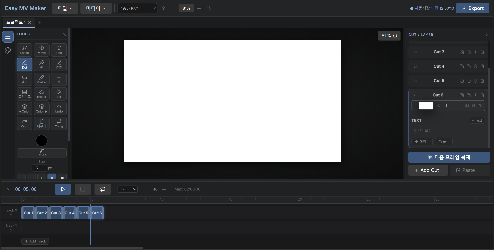

<h1 align="center">Easy MV Maker</h1>

<p align="center">
  Timeline-based frame-animation and drawing studio with a built-in canvas,<br>
  made for the Galaxy Tab — the pen draws, the finger navigates.
</p>

<p align="center">
  <a href="https://github.com/difficcd/Easy-Mv-Maker/actions/workflows/ci.yml"></a>
</p>

<p align="center">
  
  
  
  
  
  
</p>

<p align="center">
  
</p>

<p align="center"><sub>The accent colour above is user-set — one colour drives the whole UI.</sub></p>

## Features

**Drawing**
- Dot pen, marker, airbrush (blur / boiling-line modes), eraser, bucket fill, lasso, text
- Straight-line and curve ruler as two options of one tool
- Fill matches the clicked colour, so you can paint over an already-filled area
- Pen draws; finger pans and pinch-zooms (palm rejection)
- Stroke smoothing (resample → Chaikin → Catmull-Rom); in-progress strokes render incrementally on a separate overlay canvas

**Motion and effects**
- Boiling line — a shimmer applied to strokes you already drew, with amplitude, wavelength and minimum-width settings
- Mosaic and blur
- Cut animation (in/out, deform, move, easing) + part animation (lasso a region: move / rotate / scale / path)
- Keyframe tweening — shape morphing via a distance field, with centroid alignment
- Sway that follows a curve you draw, plus a bend profile using per-slice shear
- Motion presets, text animation, rich text

**Timeline and structure**
- Multi-track timeline: drag, resize, snap, loop playback, part grouping
- Cuts with layers and nestable folders; rename, collapse, multi-select
- Onion skin
- Numeric fields (speed, coordinates…) accept free input rather than being capped by the slider range

**I/O**
- Autosave, `.emv` save/open, server save
- Automatic server backup every 5 minutes, keeping the newest 12 — runs in the background without blocking the UI
- Video import from a local file or URL: frame extraction, scene-change detection, audio track
- Imports match the source video's own size by default, so a vertical shorts clip fills the canvas instead of being letterboxed; landscape and portrait presets are there too
- WebM export, PWA, Android packaging

**UI**
- English and Korean, switchable in Settings
- Dockable panels: drag a panel by its header to the left or right edge to dock it there, or drop it in the middle to pull it out as a floating window. The arrangement is remembered
- Tab hides every panel to leave just the canvas, and restores exactly what was open
- Dragging the playhead scrubs with animation, so you see the motion rather than static artwork sliding past
- Custom theme colour — one colour derives an HSL ramp applied across the whole app (playback bar, panels, buttons included), with neutral saturation adjustable too
- User-definable keyboard shortcuts
- Long jobs report progress in a corner chip instead of a full-screen overlay

## Quick Start

```bash
npm install
npm run dev      # web (:5173, LAN + QR) + API (:8787)
npm run build
```

On a tablet, scan the QR printed by `npm run dev` (same Wi-Fi). If 5173 is taken, Vite moves to 5174, 5175… — check the address in the terminal.

**Requirements**: Node 18+. Importing video from a URL needs `yt-dlp`; merged formats such as 1080p additionally need `ffmpeg`. Everything else works without either.

### Checks

```bash
npm run check      # typecheck + unit tests + hook-warning baseline + build
npm test           # node --test, no test framework dependency
npm run typecheck  # tsc --noEmit (allowJs/checkJs, files stay .jsx)
npm run lint       # eslint-plugin-react-hooks
```

The same four steps run in CI on every push and pull request.

Unit tests cover the pure helpers in `canvasUtils` — geometry, easing and waveforms, keyframe
sampling, layer flattening, and the video-import canvas sizing. They use Node's built-in runner
because none of it needs a DOM or a framework. The functions that genuinely need a 2D context
(frame extraction, stroke drawing) are deliberately not faked here.

`scripts/hook-baseline.mjs` fails only when hook dependency warnings **grow**. The remaining ones are mostly deliberate (per-frame canvas work and heavy caches), so zero isn't the target; the guard catches new stale-closure risk introduced by things like extracting custom hooks. Use `UPDATE=1 node scripts/hook-baseline.mjs` to move the baseline on purpose.

> Passing every static check does not prove a component mounts — a component returning `undefined` is legal in React. After a structural change, open the affected screen and look at it.

## Android (Capacitor)

```bash
npm run android:sync     # build web + sync
npm run android:open     # open Android Studio -> run / build APK
```

## Layout

```
src/
  App.jsx          app state, drawing pipeline, timeline logic, panel docking (~4,500 lines)
  canvasUtils.js   pure helpers: smoothing, boiling, fill, distance-field morph, waveforms
  i18n.js          the English dictionary (~500 entries) and the tr() lookup
  Modals.jsx       project picker, settings, help, video import, scene detect
  TopBar.jsx  Timeline.jsx  CutLayerPanel.jsx  ColorPanel.jsx  AnimPanels.jsx
  globals.d.ts     ambient declarations (EyeDropper, Capacitor, File System Access…)
server/index.js    project storage + backup rotation + video/audio import API
scripts/           hook-warning baseline guard
```

The Korean source text doubles as the translation key, gettext style, so a missing entry shows
Korean rather than an empty label. The lookup is named `tr`, not `t`, because `t` is already a
local variable in dozens of places here.

## Notes

**The server is for local use only.** It is a convenience for reaching your own machine from a
tablet on the same Wi-Fi, and it is not written to be exposed to anything wider:

- No authentication of any kind. Anyone who can reach :8787 can read, overwrite and delete every
  project, and trigger downloads.
- It listens on all interfaces, because the tablet has to reach it. On an untrusted network that
  means everyone on that network.
- Asset uploads accept up to 1GB of raw body per request, so an open port is also a way to fill
  your disk.
- Path traversal is handled — project ids are sanitised before touching the filesystem — but that
  is the only hostile input it defends against.

Run it behind your own firewall on a network you control. Do not port-forward it.

Video import is intended for local, personal use. Respect the source service's terms and copyright.

## License

Not decided yet — all rights reserved for the moment. This is a personal project that
may end up as a paid app, so I'm keeping the options open rather than picking a licence
I'd regret. Open an issue if you'd like to use or build on it and I'll sort it out.
